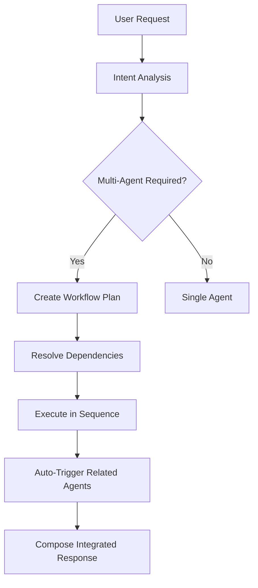

# 🤖 Automated Multi-Agent Workflow System

## Overview

The AI Design Suite now features a **fully automated multi-agent workflow system** that intelligently coordinates multiple engineering agents to complete complex design projects without manual intervention.

## 🎯 Key Features

### 1. **Intelligent Agent Selection**
- Automatically analyzes user requests to determine required engineering disciplines
- Selects appropriate agents based on project complexity and scope
- Supports single-agent, multi-agent, and comprehensive workflows

### 2. **Dependency-Based Task Sequencing**
- Automatically resolves dependencies between engineering tasks
- Executes agents in optimal order (e.g., Civil → Structural → MEP → BOM → Compliance)
- Uses topological sorting for complex dependency graphs

### 3. **Automatic Agent Triggering**
- Agents can automatically trigger related agents based on their results
- Example: Structural design → automatically triggers BOM and Compliance
- Context-aware triggering based on intermediate results

### 4. **Context Passing & Integration**
- Results from previous agents are automatically passed as context to subsequent agents
- Maintains project coherence across all engineering disciplines
- Intelligent response composition from multiple agent outputs

## 🚀 How It Works

### Automated Workflow Triggers

The system automatically initiates multi-agent workflows when it detects:

```
Keywords: "complete", "full", "comprehensive", "automated", "end-to-end"
Multiple disciplines: "structural and electrical", "MEP systems"
Complex projects: "building design", "complete analysis"
```

### Agent Capability Matrix

Each agent has defined capabilities and relationships:

```python
Agent Capabilities:
├── Civil Engineering
│   ├── Inputs: site_requirements, project_scope
│   ├── Outputs: site_analysis, foundation_requirements
│   ├── Dependencies: [] (typically first)
│   └── Triggers: [structural, sustainability]
│
├── Structural Engineering  
│   ├── Inputs: loads, spans, materials, site_analysis
│   ├── Outputs: beam_design, structural_analysis
│   ├── Dependencies: [civil]
│   └── Triggers: [bom, compliance, mechanical, electrical]
│
├── Mechanical Engineering
│   ├── Inputs: system_requirements, structural_design
│   ├── Outputs: mep_design, equipment_specs
│   ├── Dependencies: [structural, interior]
│   └── Triggers: [electrical, bom]
│
└── [Additional agents...]
```

### Execution Flow



## 🎮 Usage Examples

### Example 1: Complete Building Design
```bash
Request: "Design a complete office building with all systems and cost analysis"

Automated Execution:
1. Civil Agent: Site analysis and foundation planning
2. Structural Agent: Building frame design and analysis  
3. Interior Agent: Space planning and layouts
4. Mechanical Agent: HVAC and MEP systems
5. Electrical Agent: Power and lighting systems
6. BOM Agent: Material lists and cost estimation
7. Compliance Agent: Code compliance checking
8. QA Agent: Quality assurance and review
9. [Auto-triggered] Sustainability Agent: Environmental analysis

Result: Comprehensive integrated design package
```

### Example 2: Steel Structure with Cost
```bash
Request: "Design a steel frame structure and provide cost estimate"

Automated Execution:
1. Structural Agent: Steel frame design
2. [Auto-triggered] BOM Agent: Material costs and procurement

Result: Structural design with detailed cost breakdown
```

### Example 3: Sustainable Building
```bash
Request: "Create a comprehensive green building design"

Automated Execution:
1-8. [Full building design workflow]
9. Sustainability Agent: Environmental impact analysis
10. [Auto-triggered] Generative Agent: Optimization alternatives

Result: Complete sustainable design with optimization options
```

## 🔧 Configuration & Customization

### Agent Dependencies
```python
# Define custom agent relationships
agent_capabilities = {
    'structural': {
        'dependencies': ['civil'],
        'triggers': ['bom', 'compliance'],
        'duration': 3.0
    }
}
```

### Triggering Rules
```python
# Customize auto-triggering logic
async def should_trigger_agent(agent_type, previous_result, context):
    if agent_type == 'bom' and 'design' in previous_result:
        return True  # Always cost-estimate after design
    return False
```

### Workflow Optimization
- **Parallel Execution**: Independent agents run concurrently
- **Dynamic Planning**: Workflow adjusts based on intermediate results
- **Resource Management**: Optimizes execution time and dependencies

## 📊 Workflow Analytics

The system provides detailed analytics for each automated workflow:

```json
{
  "workflow_summary": "Comprehensive building design completed",
  "execution_stats": {
    "total_tasks": 9,
    "completed_tasks": 9,
    "failed_tasks": 0,
    "estimated_duration": 19.5,
    "agents_used": ["civil", "structural", "mechanical", "electrical", "interior", "bom", "compliance", "qa", "sustainability"]
  },
  "task_results": {
    "task_1": { "agent": "civil", "status": "success" },
    "task_2": { "agent": "structural", "status": "success" }
  }
}
```

## 🎯 Benefits

### For Users
- **Zero Configuration**: Just describe your project in natural language
- **Complete Automation**: No need to manually coordinate between disciplines
- **Integrated Results**: Coherent project deliverables across all engineering domains
- **Consistent Quality**: Automated QA and compliance checking

### For Complex Projects
- **Scalability**: Handles projects from simple beams to complete buildings
- **Reliability**: Dependency resolution ensures correct execution order
- **Efficiency**: Parallel execution where possible, optimal sequencing
- **Traceability**: Complete audit trail of all automated decisions

## 🚀 Getting Started

### Simple Usage
```bash
# CLI
python app.py --message "Design a complete office building" --agent root

# Web API
curl -X POST http://localhost:8001/api/v1/chat \
  -d '{"message": "Complete building design with all systems"}'
```

### Interactive Mode
```bash
python app.py --cli
> Design a comprehensive warehouse facility with automated optimization
```

### Web Interface
Visit `http://localhost:8001/docs` and use the `/chat` endpoint with:
```json
{
  "message": "Complete automated design of retail complex",
  "auto_workflow": true
}
```

## 🎉 Result

The **Automated Multi-Agent Workflow System** transforms the AI Design Suite into a truly autonomous engineering design platform that can handle complete, multi-disciplinary projects with minimal human intervention while maintaining professional quality and engineering standards.

Perfect for:
- **Rapid prototyping** of complete building designs
- **Automated feasibility studies** with cost analysis
- **Multi-disciplinary coordination** without manual management
- **Comprehensive project delivery** with integrated QA and compliance

The system demonstrates advanced AI agent coordination and represents the future of automated engineering design workflows! 🏗️🤖